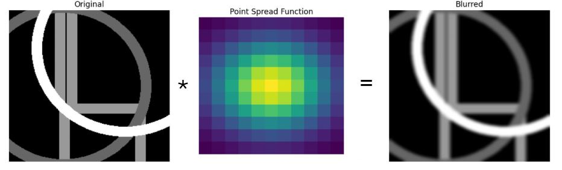

# Image Deconvolution

In image processing, **_convolution_** is operation used to combine values of pixels
from initial image with values of neighboring pixels according to weights defined by point spread function. 

**_Deconvolution_** is process that can to some extent reverse effects of convolution.

In this project we will analyze how **Richardson-Lucy algorithm**, an example of classical deconvolution algorithms,
compares to a deconvolutional **U-Net-based CNN**.

This project is done as part of the work on setup for **Quantum Imaging with Undetected Light (QIUL)**
which requires the use of deconvolution techniques to enhance image resolution.

## Artificial Dataset Creation

## Classical Algorithms: Richardson-Lucy Algorithm

## Machine Learning Algorithms: U-Net-based CNN

### Variations

## Comparison

## What's in This Repo?

- [src](src)
  - [data_helpers.py](src/data_helpers.py) - Contains class GeometricDataGenerator 
  for creation of artificial geometric dataset, functions for creation of examples for prior analysis,
  and class BBBCDataset for handling BBBC microscopy dataset. 
  - [metric_helpers.py](src/metric_helpers.py) - Implements different metric functions 
  used for evaluation of model performance, and class EdgeLoss and HybridLoss important for NN training.
  - [ml_helpers.py](src/ml_helpers.py) - Contains helper functions for training, validation, and testing of ML model.
  - [plotting_helpers.py](src/plotting_helpers.py) - Contains different functions for data visualization, 
  such as function for side by side comparison of original, blurred and (RL and/or NN) reconstructed image, 
  plotting different datasets examples, training VS validation curves, NN model validation metric comparison.
  - [testing_helpers.py](src/testing_helpers.py) - Implements functions for 
  comparative testing of RL an NN model on same dataset, and prior testing.
  - [RLdeconvolution.py](src/RLdeconvolution.py) - Contains Richardson-Lucy algorithm implementation 
  and related functions.
  - [NNdeconvolution.py](src/NNdeconvolution.py) - Contains classes for implementation of different CNN model versions.
- [tests](tests) - Contains Jupyter Notebooks that demonstrate the use of functions
  - [NNtraining.ipynb](tests/NNtraining.ipynb) - Trains multiple versions of CNN model. 
  Saves model settings as well as loss and metrics values for each epoch for comparison.
  Creates comparison plots and tables.
  The best performing model can then be determined based on these.
  - [RLvsNN.ipynb](tests/RLvsNN.ipynb) - Runs quantitative comparison: RL VS NN model. 
  2 Datasets are used - one with Gaussian blur and poisson noise included, 
  and the other that also includes full detector degradation model. 
  Comparison is done based on PSNR, SSIM and MSE values. 
  Distributions and box plots of these metrics, as well as their mean and standard deviation are reported.
  - [robustness_analysis.ipynb](tests/robustness_analysis.ipynb) - Tests how RL and NN algorithm behave
  for different degradations. Models are compared on 3 datasets with different values of blur sigma (2, 5, 10),
  and 3 datasets with different values of photon flux (20, 50, 100). 
  Distribution, box plots, means and standard deviations are reported.
  - [prior_analysis.ipynb](tests/prior_analysis.ipynb) - Tests if NN is better than RL just because it learns shapes
  that are present in the artificial dataset by comparing RL and NN performance on several example images:
  rectangle, circle, vertical bars, overlapped shapes with and without full detector model,
  white noise, and structured texture.

## Prerequisites

All packages necessary for running scripts in this repo are listed in [requirements.txt](requirements.txt).
Additionally, make sure you can run Jupyter Notebooks.
