# Image Deconvolution

In image processing, **_convolution_** is operation used to combine values of pixels
from initial image with values of neighboring pixels according to weights defined by point spread function. 

**_Deconvolution_** is process that can to some extent reverse effects of convolution.
This process has application in microscopy, astronomy, medical imaging,... 
Here it enables deblurring of the detected image to certain extent, which amplifies resolution and 
makes spotting fine structures possible.

In this project we will analyze how **Richardson-Lucy algorithm**, an example of classical deconvolution algorithms,
compares to a deconvolutional **U-Net-based CNN**.

This project is done as part of the work on setup for **Quantum Imaging with Undetected Light (QIUL)**
which requires the use of deconvolution techniques to enhance image resolution.

## Artificial Dataset Creation

This dataset is created to imitate resolution targets and etched surfaces used for initial testing of QIUL setups.
It consists of random number (2-6) shapes which can be line grids, circles, and rectangles. 
These shapes have varying size and intensity. It is also possible to create easier or harder datasets
by defining how much will the shapes be overlapped.

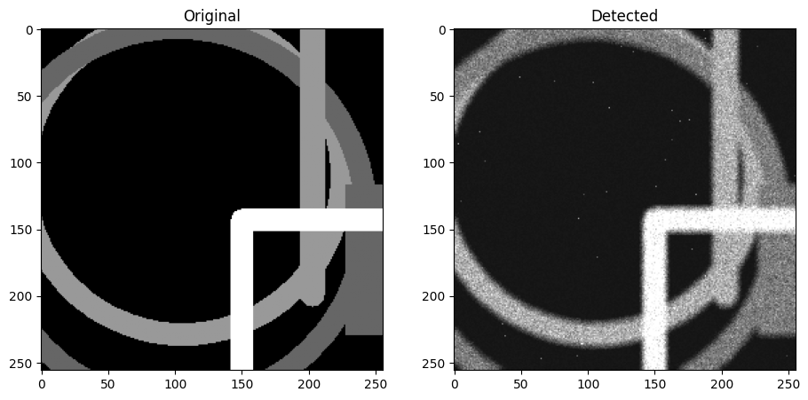

Following **sources of degradation** are modeled:
- **Gaussian blur**
  - _Cause:_ imperfections of optics and quantum correlations of photons 
  - _Effect:_ soft edges and loss of fine details
- **Poissonian noise**
  - _Cause:_ varying number of photons reaches the detector (quantum nature of light) 
  - _Effect:_ grainy image
- **Dark Counts**
  - _Cause:_ electronic sensor noise present even when there is no light source
  - _Effect:_ uniform intensity offset across the entire image
- **Hot Pixels**
  - _Cause:_ faulty detector pixels that give unrealistically high intensity reading at all times
  - _Effect:_ random high intensity specs on image
- **Dark Counts**
  - _Cause:_ ambient light that reaches the sensor
  - _Effect:_ uniform intensity offset across the entire image
- **Sensor Nonuniformity**
  - _Cause:_ nonuniform sensor sensitivity due to manufacturing imperfections
  - _Effect:_ light, constant texture across the entire image

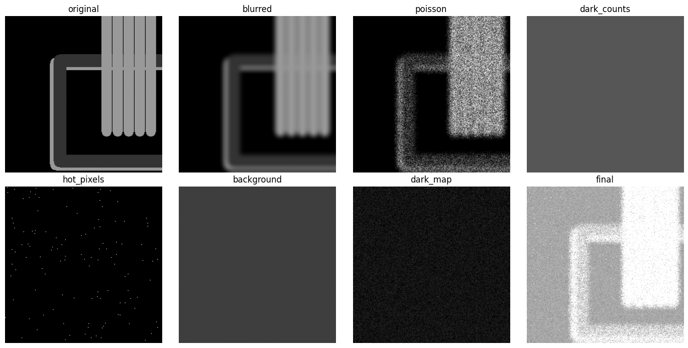

## Types of deconvolution algorithms

| Classical                                   | ML                                                                         |
|---------------------------------------------|----------------------------------------------------------------------------|
| stable and well-understood                  | "black-box" approach                                                       |
| less computationally demanding              | more computationally demanding, require large amounts of data for training |
| usually require knowledge of PSF            | knowing PSF is not necesarry                                               |
| limited usability with complex degradations | better generalization to complex examples                                  |

### Classical Algorithms: Richardson-Lucy Algorithm

**_Richardson-Lucy algorithm_** is an iterative, maximum likelihood based algorithm that requires knowledge of PSF.
RL algorithm is very sensitive to noise and PSF assumption.
When **Poissonian noise** is present this algorithm is an example of Expectation Maximization (EM) algorithms 
and it converges to Maximum Likelihood Estimator (MLE). 

Although this is generally desired property of an estimator, 
in this case it is not recommended to let the algorithm reach convergence as it can introduce artifacts and overshoots
(as algorithm will also start amplifying the noise).
Different **early stopping techniques** can be used to stop the algorithm before it converges.
In this project **oracle stopping criterion** is used.
Oracle score is calculated as combination of PSNR, MAE and SSIM between original image and current reconstruction.
Algorithm is then stopped when minimal values of oracle score is reached 
and not changed by significant value for certain number of iterations.
In reality we wouldn't have access to ground truth and would have to rely on different early stopping methods
There are two main reasons that justify the use of oracle score in our case:
- we want to compare absolutely best version of RL algorithm to NN,
- this approach is feasible option considering we have to evaluate on large dataset.

To enable algorithm to run for more iterations different **regularization techniques** can be used,
such as **Chambolle algorithm** based on Total Variation minimization. 
These techniques can smooth and slow down out noise amplification.

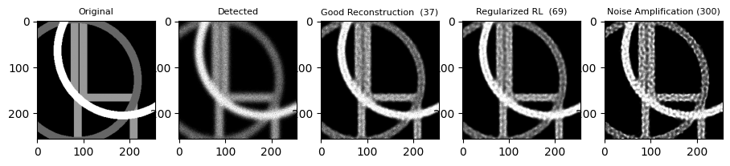

### Machine Learning Algorithms: U-Net-based CNN

**Convolutional Neural Networks (CNNs)** learn transformation between the original and detected image directly,
without requiring knowledge of PSF. They enable high-quality reconstruction and large reconstruction speed
(once we have trained network). The downsides of using CNNs are large amount of data required for training, 
and more importantly their limited receptive field. 
> _NOTE:_ **Transformers** with their global context would resolve this problem,
but their training is much more demanding in every sense.)

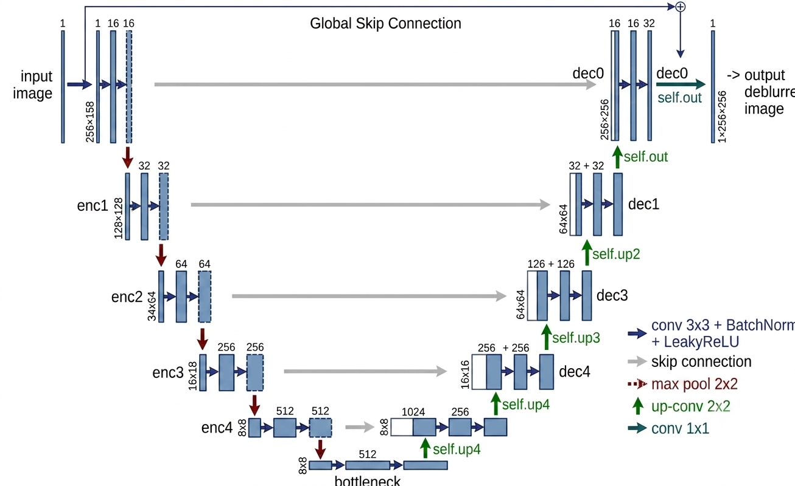

#### Variations

Multiple variations of model are trained:
- **V0 (Baseline)**: Direct Image Target, L1 Loss, No Normalization
- **V1 (BatchNorm)**: Direct Image Target, L1 Loss, BatchNorm
- **V2 (Residual)**: Residual Target, L1 Loss, BatchNorm
- **V3 (HybridLoss)**: Residual Target, BatchNorm, Hybrid Loss (0.7MAE + 0.3SSIM)

Adaptive stopping is implemented:
- training is run for 200 epochs maximum
- training stops after 20 epochs without improvement
- minimal loss improvement that is considered as such is 1e-4

Due to limited computing resources each model is trained for only 50 epochs 
and decision on the best model is made based on this (which is, of course, not ideal).

All models use dataset with full detector degradation model applied for training.

| 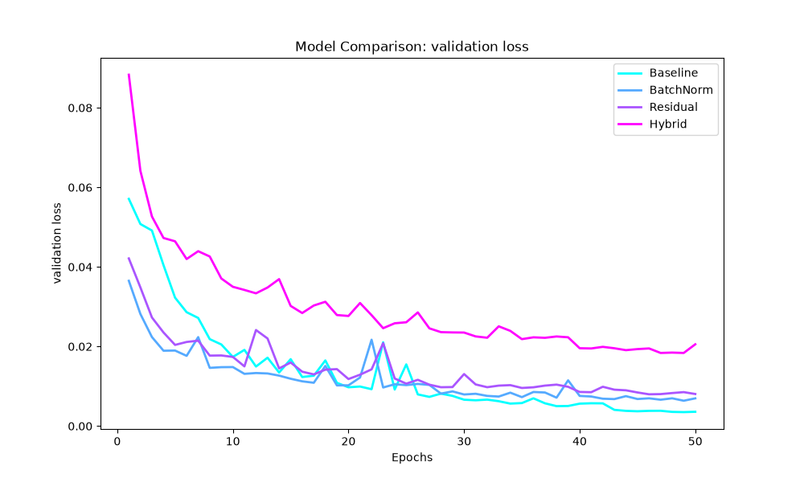 | 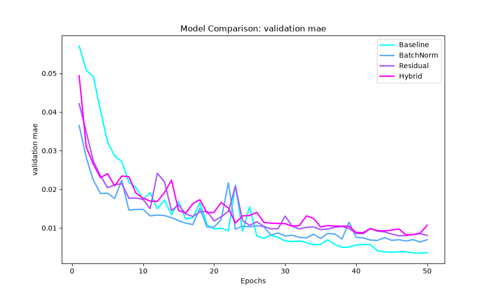  |
|------------------------------------------------|------------------------------------------------|
| 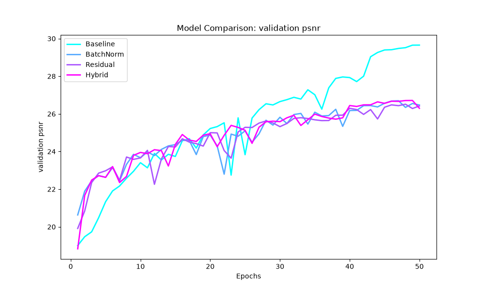 | 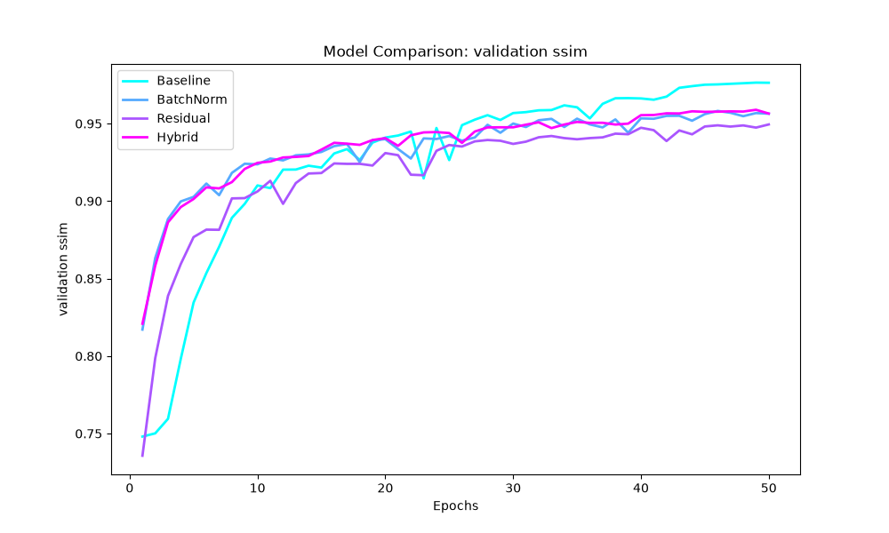 |

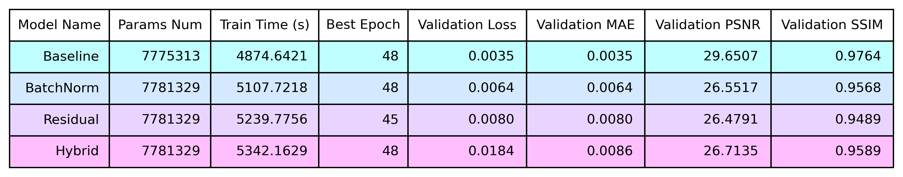

**Baseline model** showed the best performance across all parameters.

| 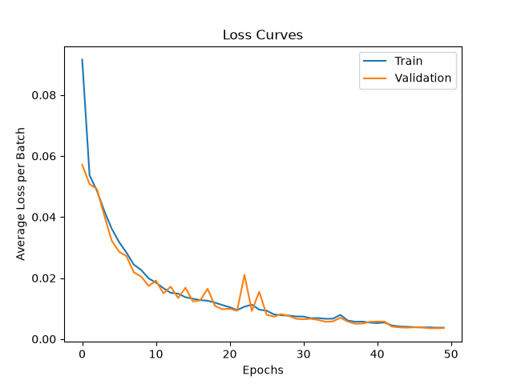 | 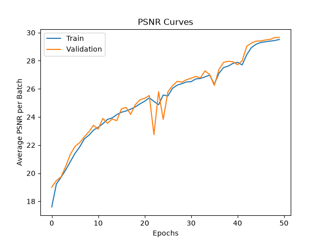 |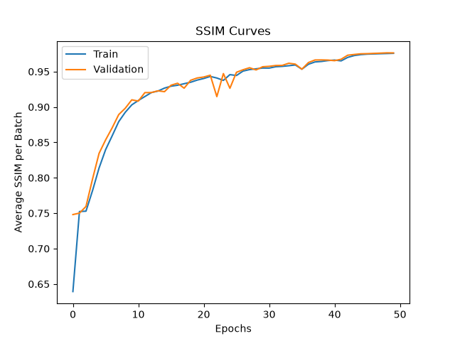|
|-------------------------------------------------|-------------------------------------------------|-|

### Comparison: RL vs NN

Quantitative comparison of RL VS NN model is run on 2 datasets are used 
- _dataset 1:_ Gaussian blur and Poisson noise included,
- _dataset 2:_ also includes full detector degradation model. 
Comparison is done based on PSNR, SSIM and MSE values. 

**Dataset 1:** Gauss + Poisson

| 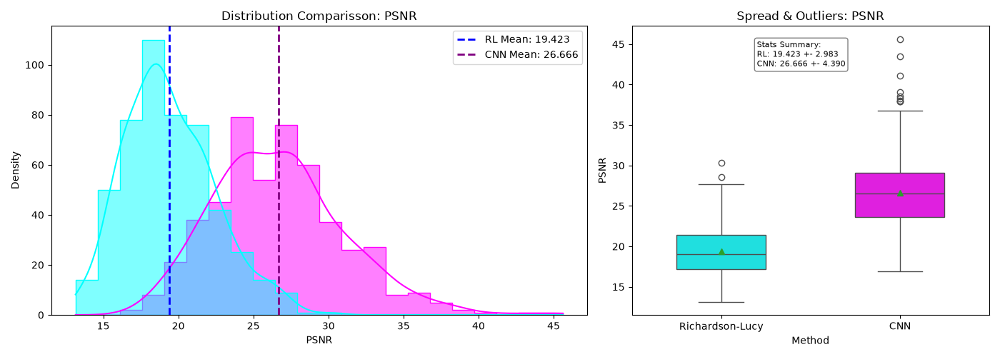 | 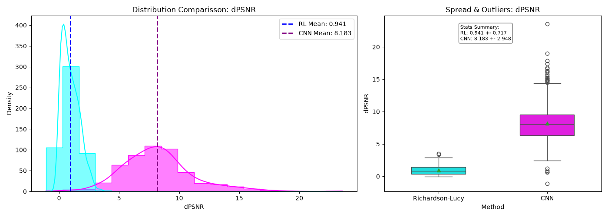 |
|---------------------------------------------------------|----------------------------------------------------------|
| 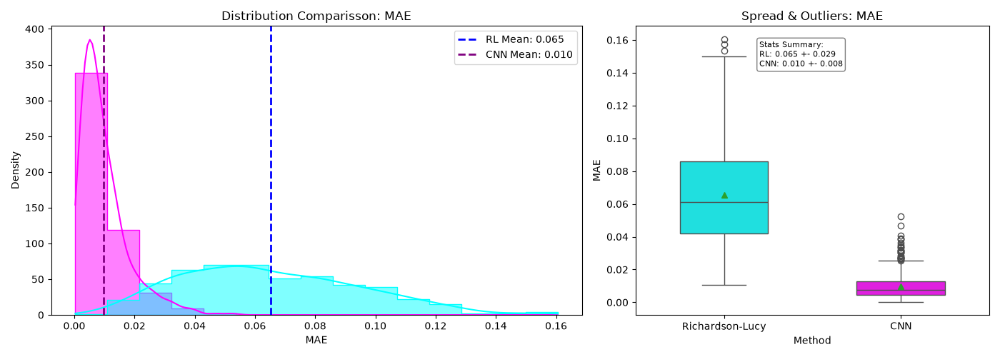  | 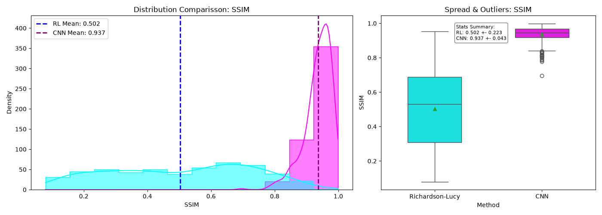  |

**Dataset 2:** Gauss + Poisson + Full Detector

| 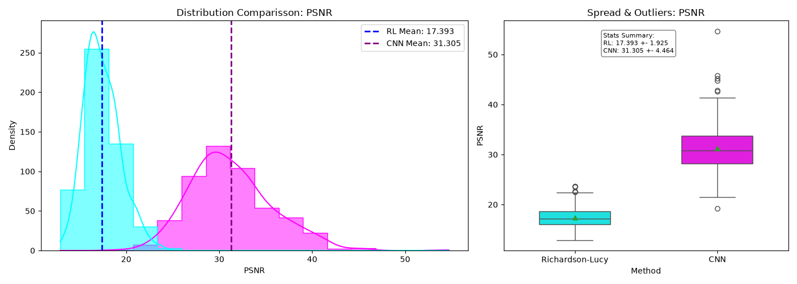 | 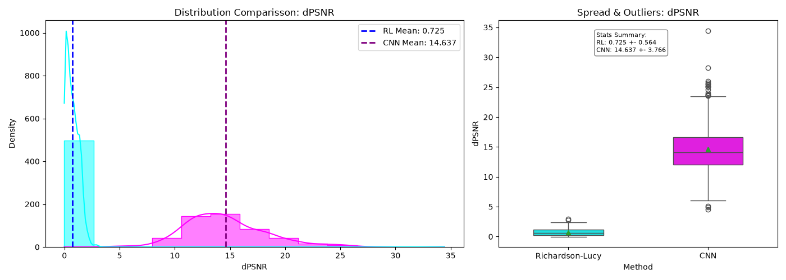 |
|---------------------------------------------------------|----------------------------------------------------------|
| 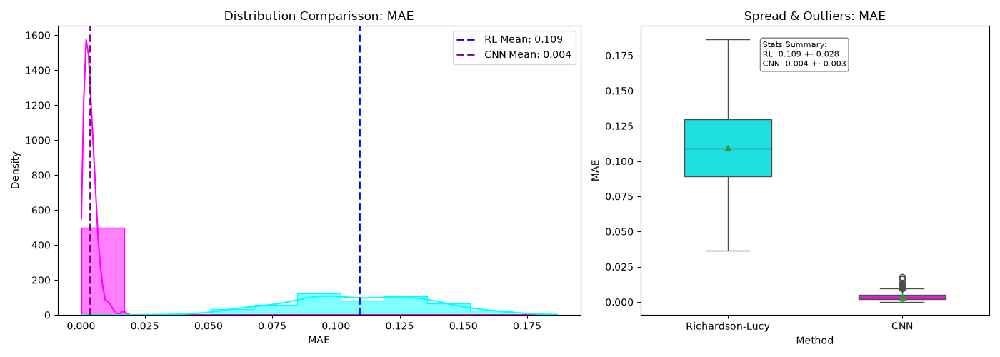  | 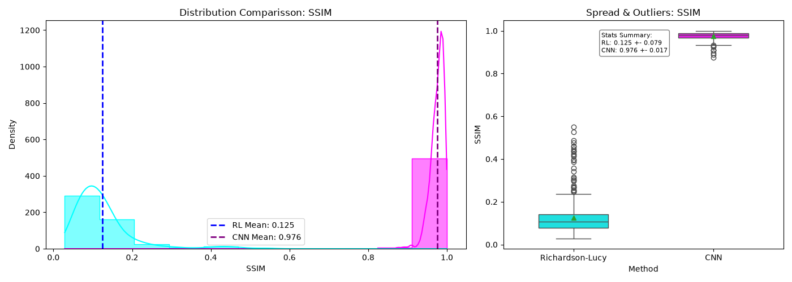  |

CNN model performs better across all observed parameters.

## Prior Analysis

The main question after comparing the algorithms: _Is NN better than RL just because it learns shapes?_

Their performance is compared once again on selected examples:

- rectangle (sharp edges):
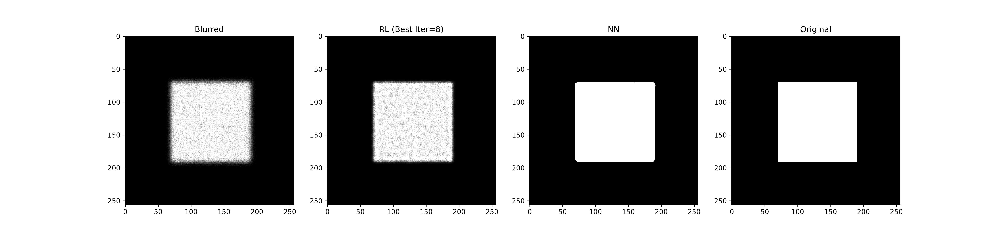
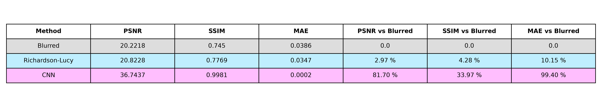
- circle (curved edges):
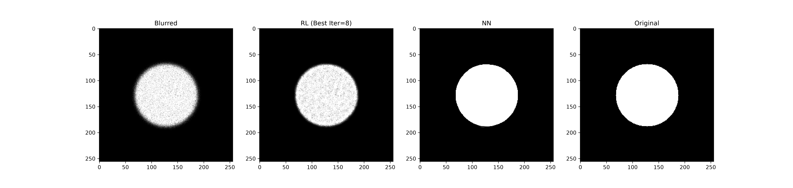
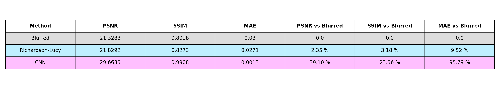
- vertical bars (repetitive shapes, test resolution):
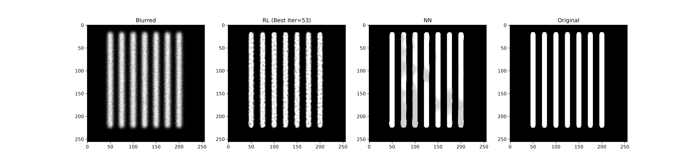
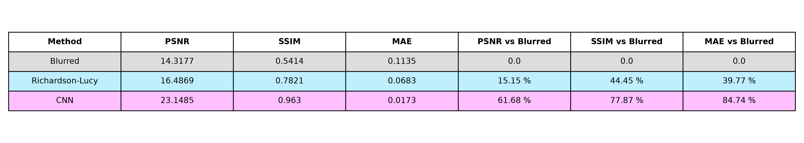
- overlapped shapes with Gaussian and Poissonian noise only:
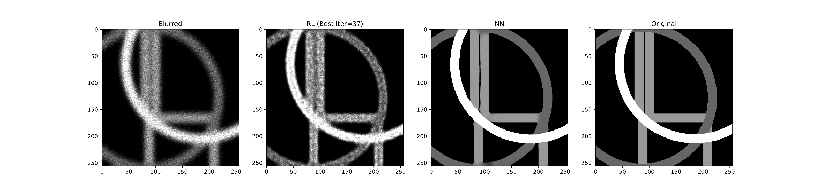
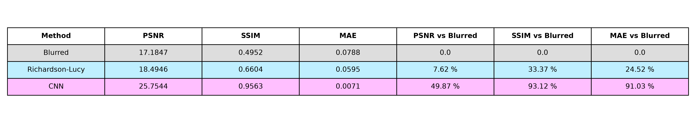
- overlapped shape with full detector model of degradation applied:
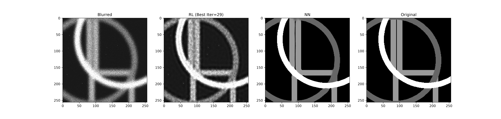
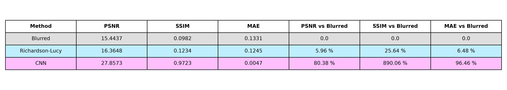
- **white noise:**
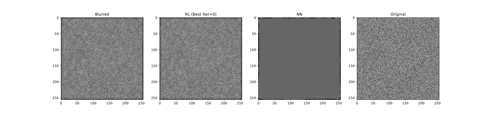
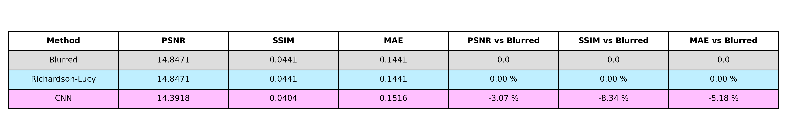
- **structured noise:**
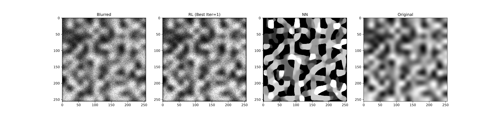
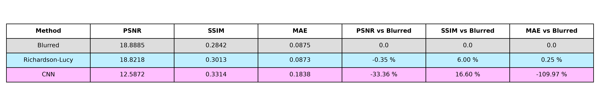

Last two examples demonstrate clearly that CNN indeed learned shapes 
and **relies heavily on this prior knowledge** that shapes must be in the picture.

To solve this we should make dataset harder by including heavier data augmentation
and adding random blurred structures and noise.
Other versions of loss, such as physics informed loss, can be explored.
This should help CNN rely less on prior knowledge and actually learn mechanics of deconvolution. 

## What's in This Repo?

- [src](src)
  - [data_helpers.py](src/data_helpers.py) - Contains class GeometricDataGenerator 
  for creation of artificial geometric dataset, functions for creation of examples for prior analysis,
  and class BBBCDataset for handling BBBC microscopy dataset. 
  - [metric_helpers.py](src/metric_helpers.py) - Implements different metric functions 
  used for evaluation of model performance, and class EdgeLoss and HybridLoss important for NN training.
  - [ml_helpers.py](src/ml_helpers.py) - Contains helper functions for training, validation, and testing of ML model.
  - [plotting_helpers.py](src/plotting_helpers.py) - Contains different functions for data visualization, 
  such as function for side by side comparison of original, blurred and (RL and/or NN) reconstructed image, 
  plotting different datasets examples, training VS validation curves, NN model validation metric comparison.
  - [testing_helpers.py](src/testing_helpers.py) - Implements functions for 
  comparative testing of RL an NN model on same dataset, and prior testing.
  - [RLdeconvolution.py](src/RLdeconvolution.py) - Contains Richardson-Lucy algorithm implementation 
  and related functions.
  - [NNdeconvolution.py](src/NNdeconvolution.py) - Contains classes for implementation of different CNN model versions.
- [tests](tests) - Contains Jupyter Notebooks that demonstrate the use of functions
  - [NNtraining.ipynb](tests/NNtraining.ipynb) - Trains multiple versions of CNN model. 
  Saves model settings as well as loss and metrics values for each epoch for comparison.
  Creates comparison plots and tables.
  The best performing model can then be determined based on these.
  - [RLvsNN.ipynb](tests/RLvsNN.ipynb) - Runs quantitative comparison: RL VS NN model. 
  2 Datasets are used - one with Gaussian blur and poisson noise included, 
  and the other that also includes full detector degradation model. 
  Comparison is done based on PSNR, SSIM and MSE values. 
  Distributions and box plots of these metrics, as well as their mean and standard deviation are reported.
  - [robustness_analysis.ipynb](tests/robustness_analysis.ipynb) - Tests how RL and NN algorithm behave
  for different degradations. Models are compared on 3 datasets with different values of blur sigma (2, 5, 10),
  and 3 datasets with different values of photon flux (20, 50, 100). 
  Distribution, box plots, means and standard deviations are reported.
  - [prior_analysis.ipynb](tests/prior_analysis.ipynb) - Tests if NN is better than RL just because it learns shapes
  that are present in the artificial dataset by comparing RL and NN performance on several example images:
  rectangle, circle, vertical bars, overlapped shapes with and without full detector model,
  white noise, and structured texture.

## Prerequisites

All packages necessary for running scripts in this repo are listed in [requirements.txt](requirements.txt).
Additionally, make sure you can run Jupyter Notebooks.
